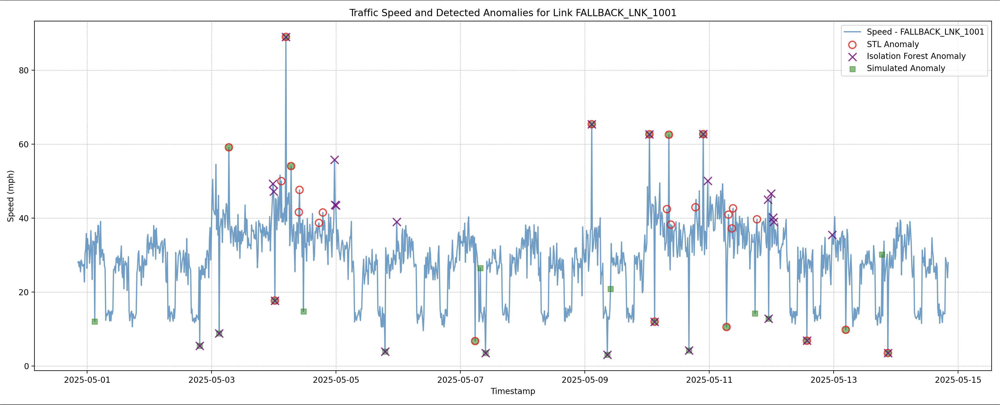
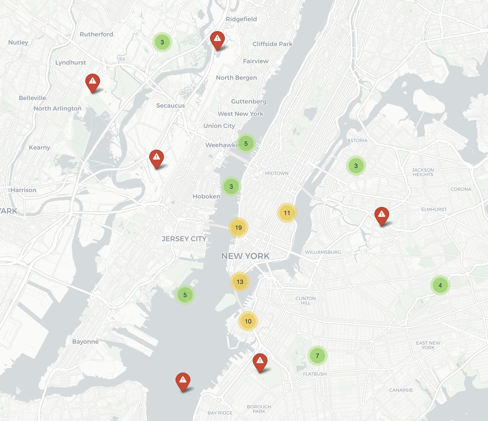

## Setup and Installation

1.  **Clone the repository (if applicable) or download the script.**

2.  **Create a Python virtual environment (recommended):**
    ```bash
    python -m venv venv
    source venv/bin/activate  # On Windows: venv\Scripts\activate
    ```

3.  **Install required Python libraries:**
    ```bash
    pip install pandas numpy geopandas matplotlib statsmodels scikit-learn folium
    ```
    *Note: Installing `geopandas` can sometimes be complex due to its dependencies (GDAL, Fiona, PyProj, Rtree). Refer to the [official GeoPandas installation guide](https://geopandas.org/getting_started/install.html) for detailed instructions specific to your operating system.*

4.  **Obtain Road Network Data (Optional but Recommended):**
    *   For NYC, download the LION Street Centerline file (usually a Shapefile) from [NYC OpenData](https://opendata.cityofnewyork.us/) or the Department of City Planning.
    *   Place the Shapefile components (e.g., `.shp`, `.dbf`, `.shx`, `.prj`) into a directory (e.g., `data/road_network/`).
    *   If you choose not to use a road network file, the script will simulate points randomly around `CITY_CENTER_NYC`.

## Usage

1.  **Configure the Script:**
    Open `urban_anomaly_detector.py` and update the following configuration parameters near the top of the file if needed:
    *   `NUM_LINKS_TO_SIMULATE`: Target number of road segments.
    *   `DAYS_OF_DATA`: Duration of simulated data.
    *   `ROAD_NETWORK_FILE`: **Crucially, update this to the correct path of your road network Shapefile (e.g., `"data/road_network/nyc_lion.shp"`).** If left as the placeholder or if the file is not found, the script will use its fallback simulation method.
    *   Other parameters like `ANOMALY_PROBABILITY`, detection thresholds in `detect_anomalies_stl` and `detect_anomalies_isolation_forest` can also be tuned.

2.  **Run the script:**
    ```bash
    python urban_anomaly_detector.py
    ```

3.  **Output:**
    *   **Console Output:** The script will print information about the data simulation process, anomaly detection steps, and summary statistics.
    *   **Time Series Plot:** A Matplotlib window will display a time series graph for an example road link, showing the speed data and highlighted anomalies (like `images/Graph.png`).
        
    *   **Interactive Map:** An HTML file named `nyc_traffic_anomalies_map.html` will be saved in the same directory as the script. Open this file in a web browser to view the interactive map of detected anomalies (like `images/Map.png`).
        

## How it Works (Briefly)

1.  **Road Network Loading (if `ROAD_NETWORK_FILE` is valid):**
    *   `geopandas` reads the specified geospatial file.
    *   A specified number of road segments are selected.
    *   Unique IDs and representative coordinates (centroids of linestrings, reprojected to WGS84) are extracted for these segments.
2.  **Traffic Data Simulation:**
    *   For each selected (or fallback-generated) road link, a time series of traffic speed is simulated.
    *   This simulation includes baseline speeds, daily/weekly rush hour patterns, weekend variations, random noise, and a configurable probability of injected anomalies (sudden speed drops or unusual clearances).
3.  **Anomaly Detection (per link):**
    *   **Data Preparation:** The time series for each link is reindexed to ensure continuity.
    *   **STL Decomposition:** The speed data is decomposed into trend, seasonal, and residual components. Points where the residual is significantly far (e.g., >3.2 standard deviations) from the mean residual are flagged as STL anomalies.
    *   **Isolation Forest:** An Isolation Forest model is trained on features (`speed_mph`, `hour_of_day`, `day_of_week`). Points that the model identifies as outliers (easily isolated) are flagged as Isolation Forest anomalies.
    *   **Combined Anomaly Flag:** A point is considered an overall anomaly if flagged by *either* STL or Isolation Forest.
4.  **Visualization:**
    *   A sample link's time series is plotted with Matplotlib, showing the raw speed and markers for detected anomalies (STL, Isolation Forest, and simulated if applicable).
    *   All detected anomalies (typically recent ones for clarity) are plotted on an interactive Folium map, with popups providing details for each anomaly.

## Future Development Ideas

*   Integrate with real-time traffic APIs (e.g., NYC's real-time traffic speed data).
*   Incorporate weather data and public event schedules as contextual factors.
*   Implement more sophisticated feature engineering for anomaly detection models.
*   Develop a web-based dashboard (e.g., using Dash or Streamlit) for interactive exploration.
*   Refine anomaly scoring or ranking based on severity.
*   Allow user feedback on detected anomalies to improve model accuracy over time.
